# SQL/ PGAdmin

## Background

Task was a research project on employees of the corporation from the 1980s and 1990s. All that remains of the database of employees from that period are six CSV files.

I designed tables to hold data from the original CSVs, imported the CSVs into a SQL database and analyzed the data for trends. In other words, I performed **data modeling**, **data engineering**, and **data analysis**.
 

#### Data Modeling
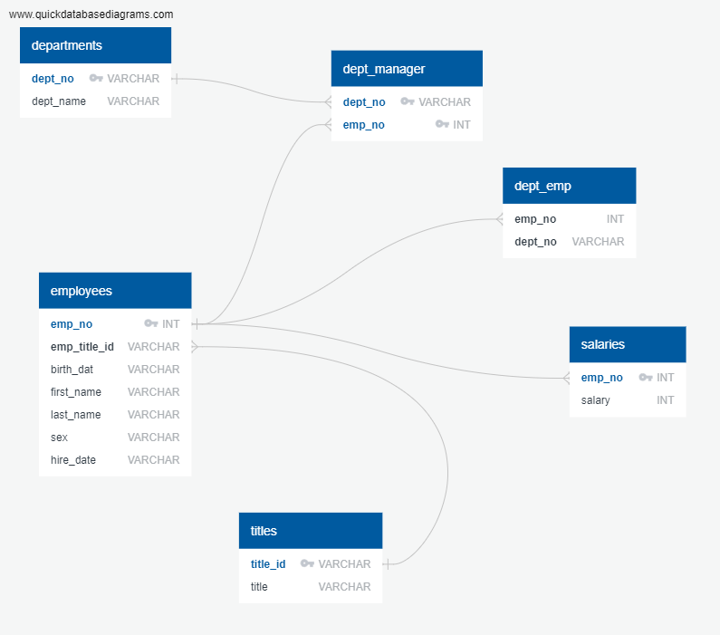
Utilized the below link to create Data Model  
[http://www.quickdatabasediagrams.com](http://www.quickdatabasediagrams.com).

#### Data Engineering

* After the creation of the Data Model, where I set the primary and foreign keys within my model. I imported the schema into PostgreSQL in order to create the tables. Once created, I imported the respective CSV files. 

#### Data Analysis

Once the database was complete:

1. I Listed the following details of each employee: employee number, last name, first name, sex, and salary. 
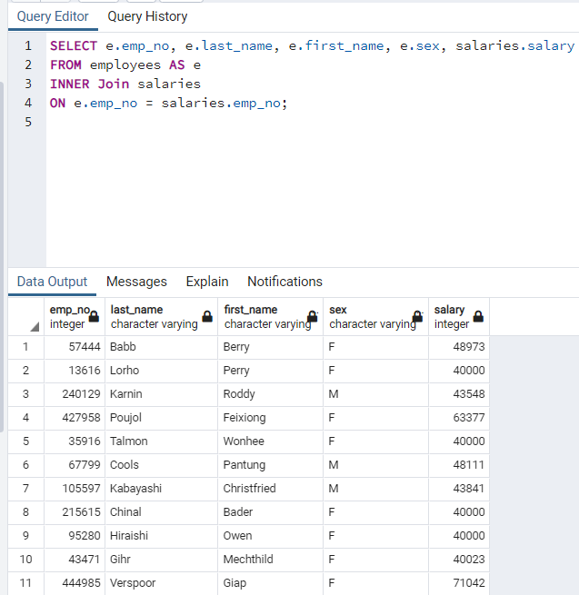
2. I Listed the first name, last name, and hire date for employees who were hired in 1986. 
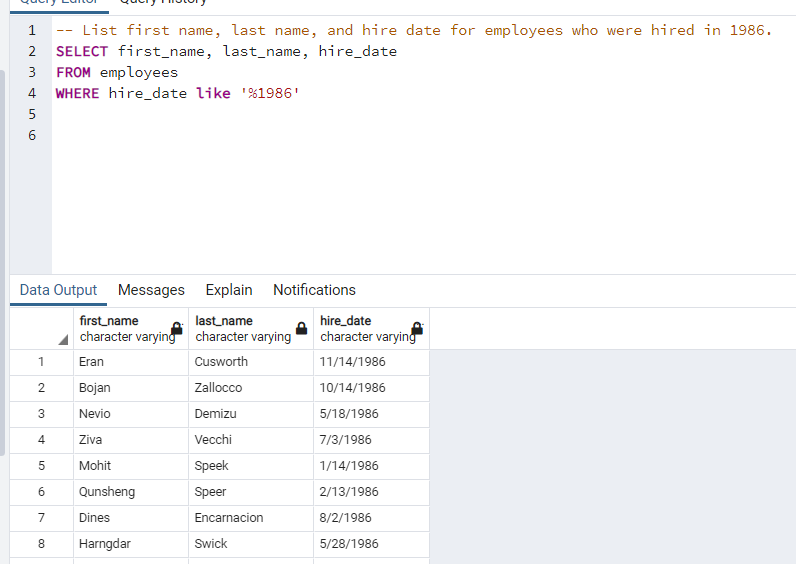
3. I Listed the the manager of each department with the following information:  
department number, department name, the manager's employee number, last name, first name. 
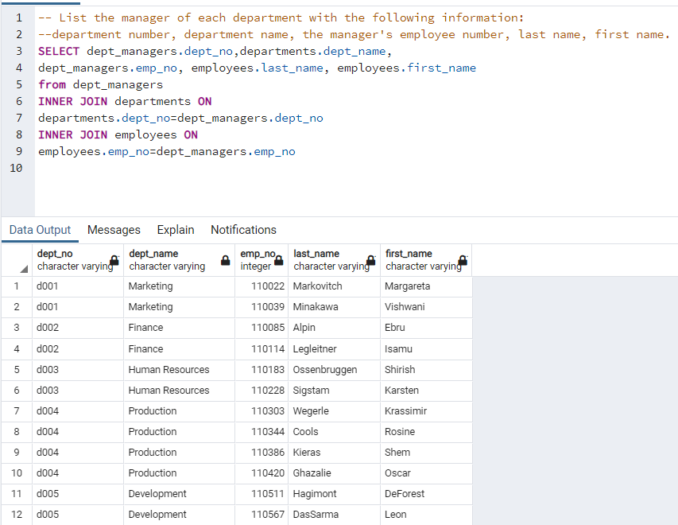
4. I Listed the the department of each employee with the following information: employee number, last name, first name, and department name. 
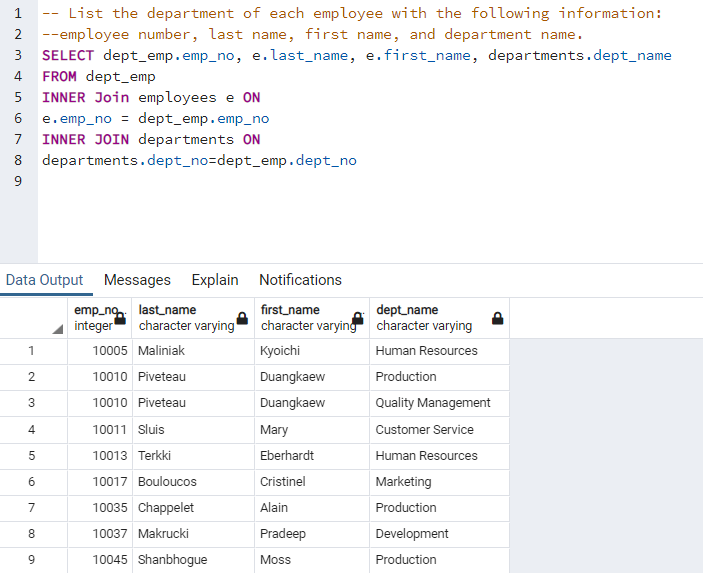
5. I Listed the first name, last name, and sex for employees whose first name is "Hercules" and last names begin with "B." 
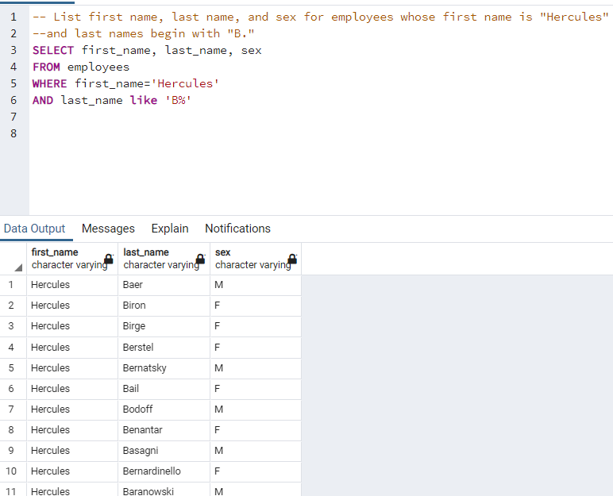
6. I Listed the employees in the Sales department, including their employee number, last name, first name, and department name. 
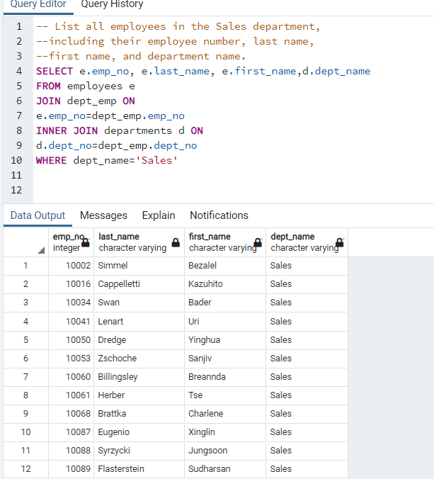
7. I Listed the all employees in the Sales and Development departments, including their employee number, last name, first name, and department name. 
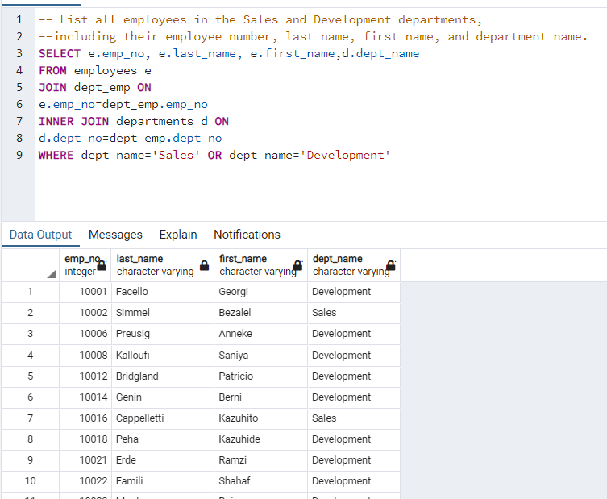
8. I Listed the frequency count of employee last names (i.e., how many employees share each last name) in descending order. 
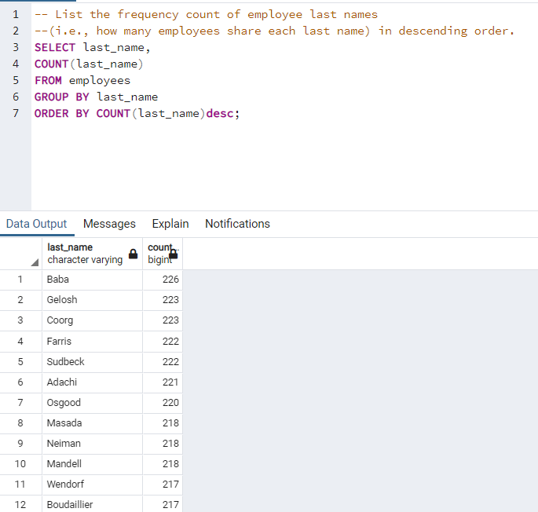

## Further Analysis

1. Imported the SQL database into Pandas. 

2. Created a histogram to visualize the most common salary ranges for employees. 

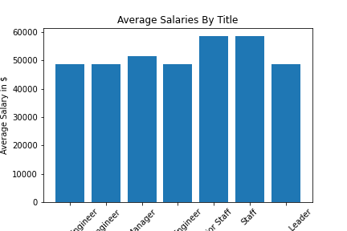

3. Created a bar chart of average salary by title. 
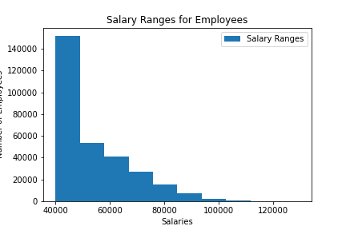

